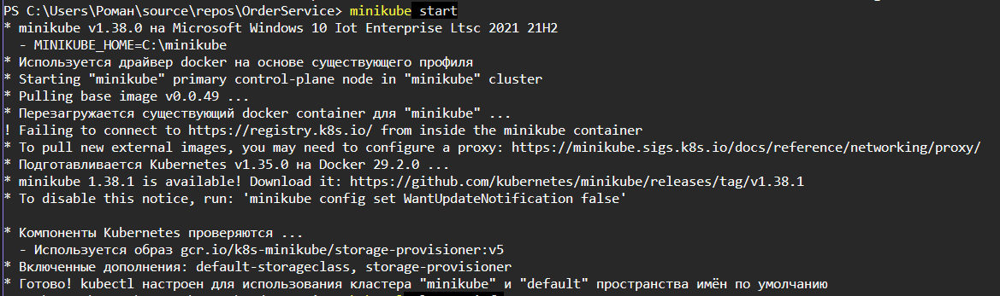
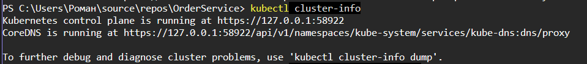
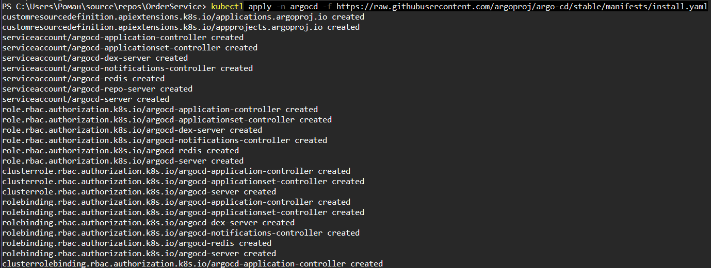
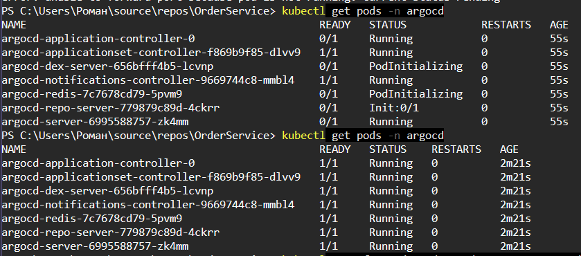
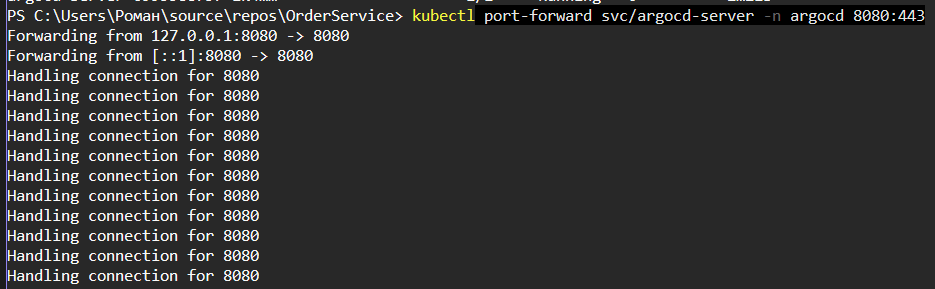
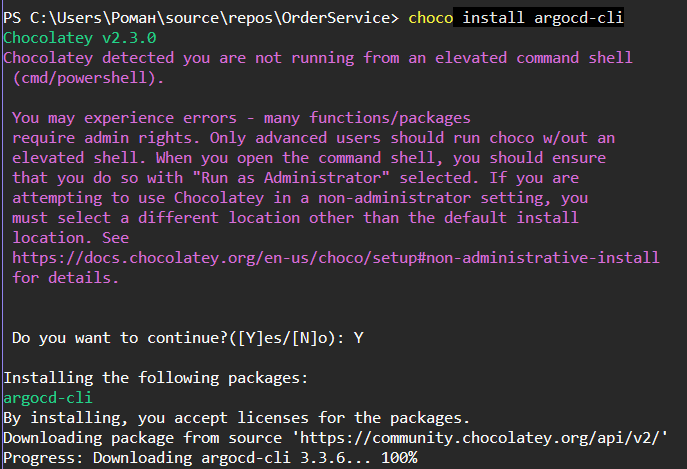
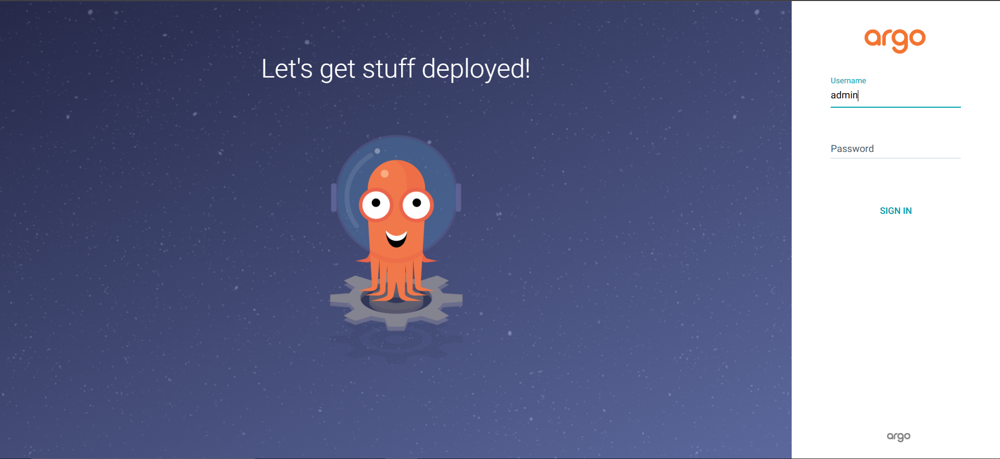
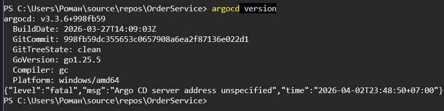

# Лабораторная работа 5: Kubernetes. Настройка проб

## Цели и задачи

**Цель работы:** научиться настраивать пробы Kubernetes для обеспечения отказоустойчивости приложений.

**Задание:** настроить liveness и readiness пробы в развернутом приложении из лабораторной работы 4.

---

## Основная часть

### Описание проекта

Проект представляет собой микросервисное приложение, состоящее из трёх компонентов:
- **OrderService** — сервис обработки заказов (ASP.NET, порт 8080)
- **NotificationService** — сервис уведомлений, подписчик Redis (ASP.NET, порт 8080)
- **Redis** — брокер сообщений (порт 6379)

Каждый сервис развёрнут в Kubernetes с помощью Deployment-манифестов. В приложениях OrderService и NotificationService реализован эндпоинт `/health`, который возвращает код 200 (Ok) в нормальном режиме и код 503 (Destroy) при переключении флага через эндпоинт `/switchFlag`.

### Настройка проб

Для каждого сервиса были настроены пробы:

**OrderService** — Liveness и Readiness пробы (HTTP):
- Liveness: `httpGet /health:8080`, delay=15s, period=10s, timeout=3s, failureThreshold=3
- Readiness: `httpGet /health:8080`, delay=20s, period=7s, timeout=2s, failureThreshold=1

**NotificationService** — Liveness и Readiness пробы (HTTP):
- Liveness: `httpGet /health:8080`, delay=20s, period=7s, timeout=2s, failureThreshold=1
- Readiness: `httpGet /health:8080`, delay=5s, period=10s, timeout=3s, failureThreshold=3

**Redis** — Liveness и Readiness пробы (TCP):
- Liveness: `tcpSocket:6379`, delay=15s, period=10s, failureThreshold=3
- Readiness: `tcpSocket:6379`, delay=5s, period=10s, failureThreshold=3

---

## Ход практической работы

### 1. Развёртывание приложения в Kubernetes

Были применены все манифесты: redis-deployment, redis-srv, order-service-deployment, order-service-srv, notification-service-deployment. После развёртывания все поды запустились в статусе Running.

*Рис. 1 — Применение манифестов и проверка статуса подов. Все поды в статусе Running.*

### 2. Просмотр конфигурации проб

С помощью команды `kubectl describe deployment` была проверена конфигурация проб для order-service. В выводе видны настроенные Liveness и Readiness пробы с параметрами.

*Рис. 2 — Описание deployment order-service с настроенными Liveness и Readiness пробами.*

### 3. Проверка логов подов

События пода notification-service показывают успешный запуск без ошибок, связанных с пробами: Scheduled, Pulled, Created, Started.

*Рис. 3 — События пода notification-service. Ошибок нет, пробы проходят успешно.*

### 4. Проверка эндпоинта /health

Через `port-forward` был проверен эндпоинт `/health`. Сервис вернул StatusCode 200 и тело ответа "Ok".

*Рис. 4 — Эндпоинт /health возвращает код 200 (Ok). Пробы проходят успешно.*

### 5. Имитация сбоя — переключение флага

Через POST-запрос на `/switchFlag` был переключён флаг `destroy_flag` в значение True. Теперь эндпоинт `/health` возвращает код 503.

*Рис. 5 — POST-запрос на /switchFlag. Ответ: Flag:True.*

### 6. Проверка /health после переключения флага

После переключения флага эндпоинт `/health` возвращает ошибку 503 — сервер не доступен.

*Рис. 6 — Эндпоинт /health возвращает код 503 (Destroy). Liveness-проба начинает фиксировать сбои.*

### 7. Наблюдение за перезапуском пода

Команда `kubectl get pods -w` показала, что Kubernetes обнаружил неудачные liveness-пробы и перезапустил контейнер order-service (колонка RESTARTS увеличилась до 1).

*Рис. 7 — Под order-service перезапущен (RESTARTS: 1) после неудачных liveness-проб.*

### 8. Проверка событий перезапущенного пода

В событиях пода видны записи о неудачных проверках:
- `Liveness probe failed: HTTP probe failed with statuscode: 503`
- `Readiness probe failed: HTTP probe failed with statuscode: 503`
- `Container order-service failed liveness probe, will be restarted`

*Рис. 8 — События пода order-service: Kubernetes зафиксировал сбои Liveness и Readiness проб и перезапустил контейнер.*

### 9. Проверка Startup Probe

Был применён альтернативный манифест `notification-service-LS-deployment.yml`, содержащий Startup Probe. Эта проба выполняется первой при запуске контейнера, и только после её успешного прохождения Kubernetes начинает выполнять Liveness-пробу.

*Рис. 9 — Применение манифеста с Startup Probe для notification-service.*

---

## Выводы

В ходе лабораторной работы были изучены и настроены три типа проб Kubernetes:

1. **Liveness Probe** — проверяет работоспособность контейнера. При неудачной проверке Kubernetes автоматически перезапускает контейнер. Было продемонстрировано, что при переключении флага `destroy_flag` эндпоинт `/health` начинает возвращать код 503, после чего Kubernetes обнаруживает сбой и перезапускает контейнер.

2. **Readiness Probe** — определяет готовность контейнера принимать трафик. При неудачной проверке контейнер исключается из маршрутизации, но не перезапускается.

3. **Startup Probe** — используется для приложений с долгим запуском. Позволяет Kubernetes дождаться завершения инициализации перед началом Liveness и Readiness проверок.

Для HTTP-сервисов (OrderService, NotificationService) использовался механизм проверки через HTTP-запросы к эндпоинту `/health`. Для Redis — проверка TCP-соединения на порт 6379. Механизм переключения флага через `/switchFlag` позволил продемонстрировать реакцию Kubernetes на неудачные пробы — автоматический перезапуск контейнера.
